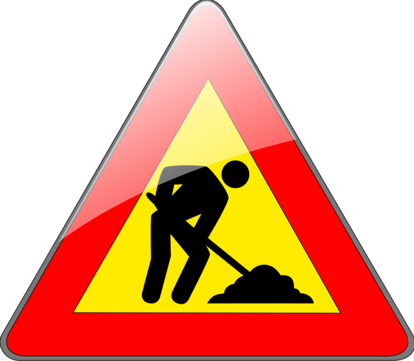
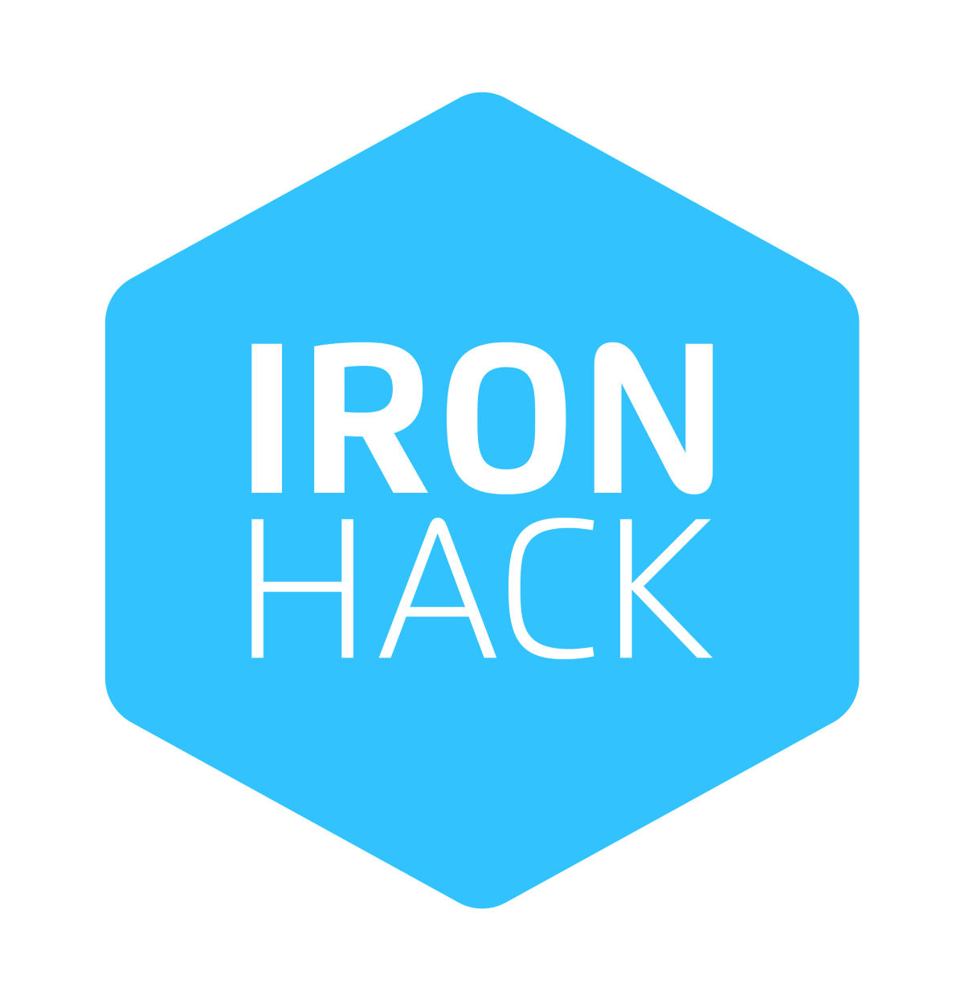
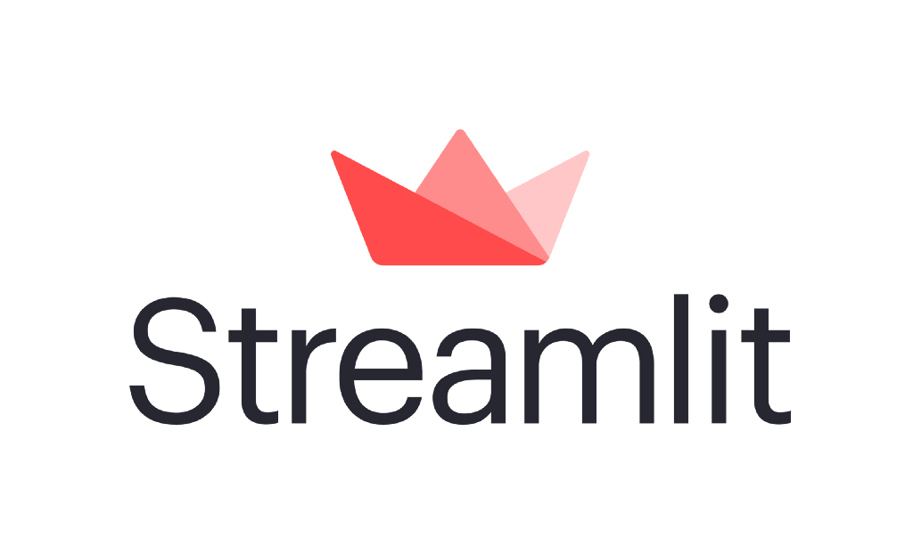
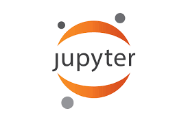
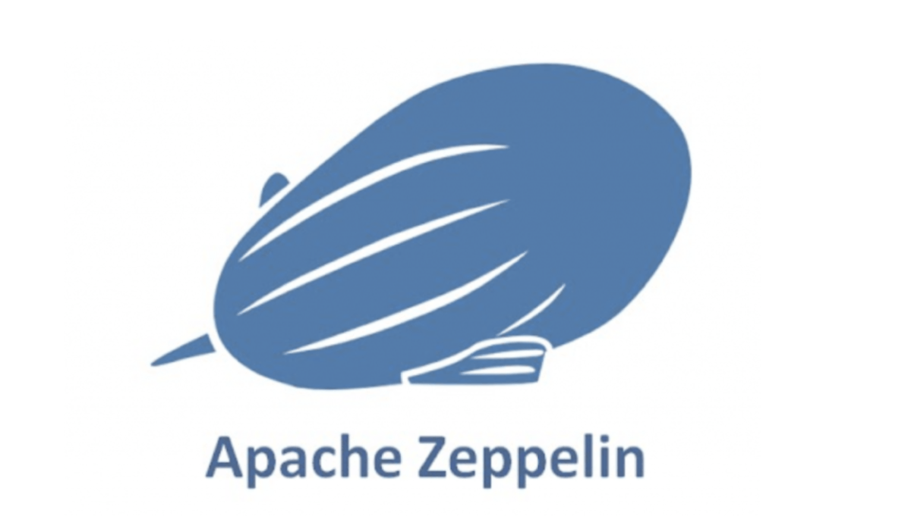

   

  

  <h1 style="font-size: 4em"> Hello World!!!!   Welcome to my Github Profile </h1>
  
This is my github profile where I have uploaded and will upload my projects.

  

 
 

# My Code

## - Scala 
- [1- Introducción](https://github.com/Scala-intro/1-Intro)
- [2-  Funciones, variables...](https://github.com/Scala-intro/2-Scala)
- [3- Ejercicio contar palabras](https://github.com/Scala-intro/3-Contador-de-palabras)
- [4- Spark Core y SQL](https://github.com/Scala-intro/4-SparkCore-SQL)
- [5-  Práctica Temperatura](https://github.com/Scala-intro/5-Temp-sensor)
- [6- Práctica personas](https://github.com/Scala-intro/6-Personas)
- [7- Práctica Personas API](https://github.com/Scala-intro/7-personas-api)
- [8- Clientes](https://github.com/Scala-intro/8-clientes)
- [9- Spark Core y Real Time](https://github.com/Scala-intro/9-SparkCore-RealTime)
- [10- Practica Streaming](https://github.com/Scala-intro/10-practica-streaming)
- [11- Practica Streaming + SQL](https://github.com/Scala-intro/11-streaming-sql)
- [12 Spark  y Machine Learning](https://github.com/Scala-intro/12-Spark-Machine-Learning)

## -  Curso DevOps &nbsp; 
- [1- Introducción](https://github.com/DevOps-docker-kubernetes/1-Intro) 
- [2- Docker](https://github.com/DevOps-docker-kubernetes/2-docker) 
- [3- Docker Compose](https://github.com/DevOps-docker-kubernetes/3-Docker-compose-orquestacion-y-escalado)

## - Spark
- [1- Intro](https://github.com/Spark-Apache-Udemy/1-Intro)
- [2- Spark Basics and the RDD Interface](https://github.com/Spark-Apache-Udemy/2-Spark-basic-RDD)
- [3- SparkSQL DataFrames and DataSets](https://github.com/Spark-Apache-Udemy/3-SparkSQL-DataFrames-and-DataSets)
- [4- Advanced Examples of Spark Programs](https://github.com/Spark-Apache-Udemy/4-Advanced-Examples-of-Spark-Programs)
- [5- Machine Learning with Spark ML](https://github.com/Spark-Apache-Udemy/5-Machine-Learning-with-Spark-ML)

## -Opencv
- [Basic](https://github.com/OpenCV-course/1-Basic)
- [Advanced](https://github.com/OpenCV-course/2-Advanced)
- [Detection faces](https://github.com/OpenCV-course/3-Faces)
- [Deep Computer Vision: The Simpsons](https://github.com/OpenCV-course/4-Deep-Computer-Vision)
- [Events Mouse](https://github.com/OpenCV-course/5-EVENT_MOUSE)

## -Streamlit 
- [First Web App in Python](https://github.com/Streamlit-library/1-Web-App-in-Python)
- [Iris Flower Prediction App](https://github.com/Streamlit-library/2-Iris-Flower-Prediction-App)
- [Penguin Classification](https://github.com/Streamlit-library/3-Penguin-Classification-)  
Deploy Heroku : https://penguins-app-web.herokuapp.com/

## - HTML, Java script and CSS

- [App-web](https://github.com/patri-carrasco/app-web) 
- [Mi ejemplo de presentación](https://github.com/patri-carrasco/portfolio)

## - Python Data Science Project

- [Python Data Science Project](https://github.com/patri-carrasco/data_junior) : This course covers linear regression, machine learning, scraping with python. 

## - Pure Python

  * [Project-Game](https://github.com/patri-carrasco/project-game) : This program emulates the game of hangman. 
  - [Dice-stimulator-code](https://github.com/Python-Project-code/Dice-stimulator-code)
  - [Dictionary](https://github.com/Python-Project-code/2-Dictionary)
  - [Tic tac toe](https://github.com/Python-Project-code/3-Tictactoe)

## - Data Cleaning & Data Visualization
* [data-cleaning-pandas](https://github.com/patri-carrasco/data-cleaning-pandas) : In this project we clean and visualize data with Pandas to work with our hypothesis. 

- [Text Data Analysis](https://github.com/Data-Analysis-Projects-Udemy/-Project-1--Text-Data-Analysis)
- [Time Series Project](https://github.com/Data-Analysis-Projects-Udemy/Project-2-Time-Series-Project)
- [Sales Data Analysis](https://github.com/Data-Analysis-Projects-Udemy/Project-4-Sales-Data-Analysis)
- [IPL Data Analysis](https://github.com/Data-Analysis-Projects-Udemy/Project-5-IPL-Data-Analysis-)

## - Scraping
* [Project-Data-Pipeline](https://github.com/patri-carrasco/Project-Data-Pipeline) : In this project we want to know the pegi (Pan European Game Information) of the games in order to be able to decide which games that can be played for ages. 

- [Web scraping usando newspaper3k](https://github.com/webscraping-python/newspaper3k)
- [BeautifulSoup Course](https://github.com/webscraping-python/BeautifulSoup-Course)
- [Disney data science](https://github.com/webscraping-python/disney-data-science-tasks)

## - GeoQueries
- [geospatial-data-project](https://github.com/patri-carrasco/geospatial-data-project) : In this project we want to analyze the best location for our company. 

- [Geospatial Analysis Project](https://github.com/Data-Analysis-Projects-Udemy/Project-3-Geospatial-Analysis-Project)

## - APIs
- [api-sentiment-project](https://github.com/patri-carrasco/api-sentiment-project) : In this project we are going to analyze feelings of a theoretical chat group of the Friends series, for this we have created an API with the messages that have been sent by the characters of the series. 

## - Machine Learning
- [diamonds-project](https://github.com/patri-carrasco/diamonds-project) : In this project we are going to do a Kaggle competition, making the best diamond price prediction. 

- [Color detection](https://github.com/Machine-Learning-project-python/color-detection)
- [Faces detection](https://github.com/Machine-Learning-project-python/faces_detection)
- [Faces recognition](https://github.com/Machine-Learning-project-python/faces_recognition)
- [Face Recognizer through a Model Training](https://github.com/Machine-Learning-project-python/faces_train)
- [Predict Fare of Airlines](https://github.com/Data-Analysis-Projects-Udemy/Project-6-Predict-Fare-of-Airlines-) 
- [Predict Password Strength Natural Language Processing](https://github.com/Data-Analysis-Projects-Udemy/Project-7-Predict-Password-Strength-Natural-Language-Processing)
- [Predict Stock Prices using Time Series Analysis](https://github.com/Data-Analysis-Projects-Udemy/Project-8-Predict-Stock-Prices-using-Time-Series-Analysis)
- [Titanic](https://github.com/Machine-Learning-project-python/Titanic)
- [Iris Species](https://github.com/Machine-Learning-project-python/Iris-species)

### - Scikit-learn 
- [1-Intro](https://github.com/Scikit-learn-freecodecamp/1-Intro-scikit-learn)

## - Natural Language Processing
- [Movie_recommender](https://github.com/patri-carrasco/Movie_recommender) : In this final project we are going to make a movie recommender with NPL 

## - Bootstrap 
- [1-Intro](https://github.com/Bootstrap-4-course/1-Intro)

## - Forks for studying & learning
- [Ironhack-Prework](https://github.com/patri-carrasco/prework-datamad-no-solutions): very first steps. First Python contact.
- [Ironhack-Labs](https://github.com/patri-carrasco/datamad1020-rev) : Labs performed during the bootcamp

- [Data-Analysis-with-Python](https://github.com/patri-carrasco/Data-Analysis-with-Python---Full-Course-for-Beginners-Numpy-Pandas-Matplotlib-Seaborn-) Practicing data with Python from freecodecamp.org
 
 
 
 

 

# Stack:

## Back end
 &nbsp;&nbsp;&nbsp;&nbsp;&nbsp;&nbsp; 
 &nbsp;&nbsp;&nbsp;&nbsp;&nbsp;&nbsp; 
 

## Machine Learning
 &nbsp;&nbsp;&nbsp;&nbsp;&nbsp;&nbsp; 
 &nbsp;&nbsp;&nbsp;&nbsp;&nbsp;&nbsp; 
 &nbsp;&nbsp;&nbsp;&nbsp;&nbsp;&nbsp; 
 &nbsp;&nbsp;&nbsp;&nbsp;&nbsp;&nbsp; 
 &nbsp;&nbsp;&nbsp;&nbsp;&nbsp;&nbsp; 

 

## Front end
 &nbsp;&nbsp;&nbsp;&nbsp;&nbsp;&nbsp; 
 &nbsp;&nbsp;&nbsp;&nbsp;&nbsp;&nbsp; 
 &nbsp;&nbsp;&nbsp;&nbsp;&nbsp;&nbsp; 

 

## BBDD
 &nbsp;&nbsp;&nbsp;&nbsp;&nbsp;&nbsp; 
 &nbsp;&nbsp;&nbsp;&nbsp;&nbsp;&nbsp; 

 

## Herramientas de desarrollo
 &nbsp;&nbsp;&nbsp;&nbsp;&nbsp;&nbsp; 
 &nbsp;&nbsp;&nbsp;&nbsp;&nbsp;&nbsp; 
 &nbsp;&nbsp;&nbsp;&nbsp;&nbsp;&nbsp;
 &nbsp;&nbsp;&nbsp;&nbsp;&nbsp;&nbsp; 
 &nbsp;&nbsp;&nbsp;&nbsp;&nbsp;&nbsp; 
 &nbsp;&nbsp;&nbsp;&nbsp;&nbsp;&nbsp; 
 &nbsp;&nbsp;&nbsp;&nbsp;&nbsp;&nbsp; 

 

## Visualización
 &nbsp;&nbsp;&nbsp;&nbsp;&nbsp;&nbsp; 
 &nbsp;&nbsp;&nbsp;&nbsp;&nbsp;&nbsp; 

## My Github statistics:

## My Top Used Languages:

## Contact me!: 

&nbsp;&nbsp;&nbsp;&nbsp;&nbsp;&nbsp; 

